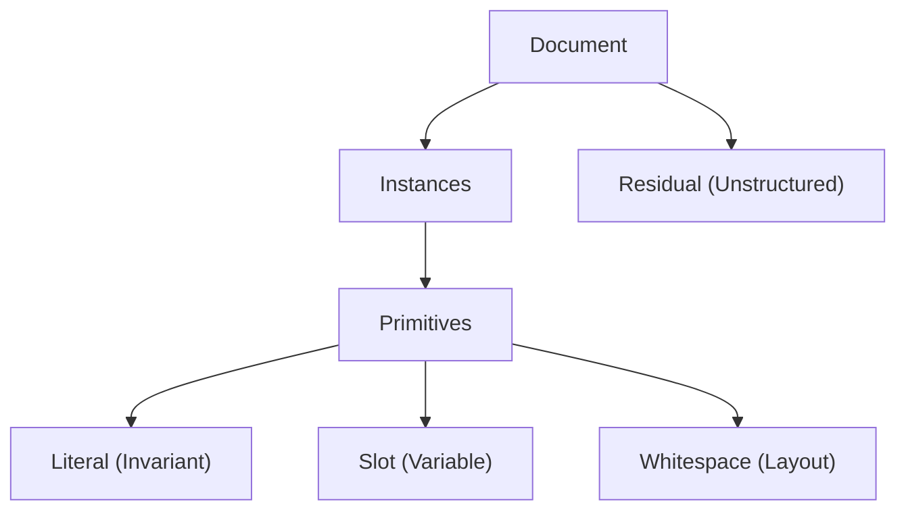

# Wring

Single-document template induction from internal repetition.

**Status**: Research phase

## Problem

Given one document, infer a compact set of recurring patterns (templates) and an instance map of their occurrences. 

The goal is to optimize for a balance of compression and human interpretability.

## Use Cases

Prioritize interpretability over maximal compression:
 * Structured documents (budget bills, legislation): infer markup structure for annotation or XML conversion
 * Web development: convert repetitive HTML into data-driven JS generation
 * Logs: separate boilerplate from variable content to surface the actual information

## Core Objectives

 * **Character Allocation**: Every character—including whitespace—is allocated to one of three primitive types: Literals, Slots, or Whitespace. Un-patterned text is designated as Residual.
 * **Reconstruction Fidelity**: The default model aims for exact reproduction. By treating Whitespace as a distinct primitive, the system can optionally expunge "formatting noise" for readability, acknowledging the trade-off.
 * **Structural Separation**: The system decomposes the document into recurring structural patterns (templates) and their specific occurrences (instances), separating boilerplate from variable content.
 * **Browser-First Performance**: Discovery and indexing logic is optimized for browser memory and execution limits (~100KB–10MB range), utilizing WASM for high-density indexing where necessary.

## Key Assumptions

* **Templates are Grounded in Repeats**: Templates link repeated substrings. We can start from repeated substrings and get to any template. 
* **The "DRY" Objective**: The goal is to "dry up" a document to make the underlying data more intelligible by removing redundant text.
* **Structural vs. Floating Repeats**: Some repeats are "foundational" and tied to document architecture; others are "floating" or transversal. What constitutes structure must be assessed from a perspective. Low variance in relative distance suggests structural; high variance suggests incidental.
* **Idealized Forms**: A template should bind to a meaningful structure. This may involve gravitating toward instances that support a coherent model, and away from instances that pollute it.
* **Flat or Hierarchical**: Instances may cover disjoint regions (flat model, simple interval scheduling) or form a parse DAG where templates contain other templates (hierarchical model, captures nesting but requires defined decoding order). Either may be of interest depending on the document.
* **Navigable Discovery**: Discovery may benefit from a human-in-the-loop process. The algorithm proposes potential structures; the user navigates and selects the abstractions that are most meaningful.

---

## Pipeline

Four phases, each with associated optimization problems. Any phase may terminate early when diminishing returns or residual entropy indicate satiety.

### 1. Substring Discovery

Enumerate repeated substrings; rank by structural signal.

| Problem | Input | Objective | Constraint |
|---|---|---|---|
| Repeat Enumeration | Document, min length, min frequency | All maximal repeated substrings | O(n) space; efficient LCP-interval traversal |
| Anchor Ranking | Repeated substrings | Score by structural signal vs. incidental repetition | Length × frequency baseline; topological neighborhood weight |

**Algorithms**: Suffix array + LCP interval traversal; suffix tree internal nodes; suffix automaton. Winnowing/fingerprinting for coarse seeding on large documents.

**Failure modes**:
- *Token Splitting*: Pattern boundaries landing inside semantic atoms (words, numbers)

### 2. Topology

Reduce document to symbol stream; score pairwise consistency; mine anchor chains.

| Problem | Input | Objective | Constraint |
|---|---|---|---|
| Pairwise Consistency | Symbol stream, symbol pair (A, B) | Measure variance of gap distances across all co-occurrences | Low variance → structural; high variance → floating |
| Distance Matrix | Symbol stream, all symbol pairs | Pairwise consistency scores as adjacency weights | Sparse: only pairs within max gap window |
| Sequence Mining | Distance matrix, max gap | Ordered anchor chains (paths) with consistent spacing | Chains must appear ≥ k times |

**Algorithms**: Sequential pattern mining (PrefixSpan, GSP) with max-gap constraints. Distance decay scoring. Cross-correlation for lag detection.

**Failure modes**:
- *Conflation*: Distinct structures collapsing into a single generic template via shared syntax
- *Scale Bias*: Capturing the broad container while missing discrete items within (or vice versa)

### 3. Refinement

Gravitate templates toward idealized forms; adjust slot boundaries; infer slot types.

| Problem | Input | Objective | Constraint |
|---|---|---|---|
| Idealized Refinement | Candidate template, bound instances | Gravitate toward instances with coherent slot signatures | Reject/expunge instances that pollute the structural model |
| Template Merge/Split | Similar or high-variance templates | Unify or partition templates toward idealized form | Merge/split based on dictionary cost vs. slot entropy |
| Slot Boundary Refinement | Template skeleton, instance alignments | Minimize slot entropy while preserving token integrity | Boundaries align with token edges or stable whitespace boundaries |
| Slot Typing | Slot values across instances | Infer regex, character class, or grammar for content | Aids interpretability and validation |

**Algorithms**: Center-star alignment for multi-instance comparison. Gap entropy as stitching heuristic. Edit distance for near-miss detection.

**Failure modes**:
- *Shattering*: Cohesive logical units fracturing into disconnected micro-templates
- *Cost Modeling*: Miscalculating the utility of merging variants versus keeping them distinct

### 4. Selection

Resolve overlaps; infer nesting; select final template set.

| Problem | Input | Objective | Constraint |
|---|---|---|---|
| Overlap Resolution | Conflicting candidate instances | Select non-overlapping subset maximizing total gain | Weighted interval scheduling (flat) or DAG (hierarchical) |
| Hierarchical Nesting | Selected templates/instances | Infer nesting; build structural parse tree | Parent must fully enclose child instances |
| Template Selection | Global template pool | Maximize total DRY gain and intelligibility | Balance model complexity vs. document coverage |
| Residual Diagnosis | Unmatched spans | Distinguish noise from near-misses; assess entropy | High entropy → satiety; low entropy → latent structure |

**Algorithms**: Weighted interval scheduling (flat model). DAG selection for hierarchical. Krimp-style greedy (accept if total code length decreases). MDL-style objective with explicit costs to prevent degenerates.

**Failure modes**:
- *Cost Modeling*: Slot encoding costs that don't reflect actual complexity (whitespace < bounded integer < unconstrained string)

---

## Supporting Documents

- **Intuition.md**: First-principles observations about template structure
- **Terms.md**: Vocabulary for matching (seat, bind, register) and emergence (crystallize, induce, distill)
- **Order.md**: Quantifying ordered relationships; distinguishing structural anchors from variable decoys
- **Discovery.md**: The symbol-reduction framing of template inference