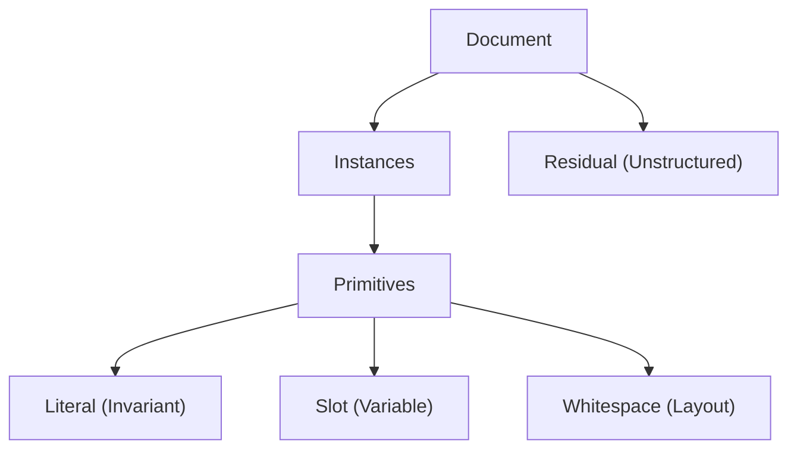

# Wring

Single-document template induction from internal repetition.

**Status**: Research phase

## Problem

Given one document, infer a compact set of recurring patterns (templates) and an instance map of their occurrences. 

The goal is to optimize for a balance of compression and human interpretability.

## Use Cases

Prioritize interpretability over maximal compression:
 * Structured documents (budget bills, legislation): infer markup structure for annotation or XML conversion
 * Web development: convert repetitive HTML into data-driven JS generation
 * Logs: separate boilerplate from variable content to surface the actual information

## Core Objectives

 * **Character Allocation**: Every character—including whitespace—is allocated to one of three primitive types: Literals, Slots, or Whitespace. Un-patterned text is designated as Residual.
 * **Reconstruction Fidelity**: The default model aims for exact reproduction. By treating Whitespace as a distinct primitive, the system can optionally expunge "formatting noise" for readability, acknowledging the trade-off.
 * **Structural Separation**: The system decomposes the document into recurring structural patterns (templates) and their specific occurrences (instances), separating boilerplate from variable content.
 * **Browser-First Performance**: Discovery and indexing logic is optimized for browser memory and execution limits (~100KB–10MB range), utilizing WASM for high-density indexing where necessary.

## Key Assumptions

* **Templates are Grounded in Repeats**: Templates link repeated substrings. We can start from repeated substrings and get to any template. 
* **The "DRY" Objective**: The goal is to "dry up" a document to make the underlying data more intelligible by removing redundant text.
* **Structural vs. Floating Repeats**: Some repeats are "foundational" and tied to document architecture; others are "floating" or transversal. What constitutes structure must be assessed from a perspective. Low variance in relative distance suggests structural; high variance suggests incidental.
* **Idealized Forms**: A template should bind to a meaningful structure. This may involve gravitating toward instances that support a coherent model, and away from instances that pollute it.
* **Flat or Hierarchical**: Instances may cover disjoint regions (flat model, simple interval scheduling) or form a parse DAG where templates contain other templates (hierarchical model, captures nesting but requires defined decoding order). Either may be of interest depending on the document.
* **Navigable Discovery**: Discovery may benefit from a human-in-the-loop process. The algorithm proposes potential structures; the user navigates and selects the abstractions that are most meaningful.

---

## Pipeline

Four phases, each documented in detail. Any phase may terminate early when diminishing returns or residual entropy indicate satiety.

| Phase | Goal | Key Output |
|-------|------|------------|
| [1-Discovery](1-Discovery.md) | Enumerate repeated substrings | Vocabulary-to-Symbol mapping |
| [2-Topology](2-Topology.md) | Score pairwise consistency; mine anchor chains | Distance matrix, candidate chains |
| [3-Refinement](3-Refinement.md) | Align instances; merge/split templates | Refined templates with typed slots |
| [4-Selection](4-Selection.md) | Resolve overlaps; select final template set | Non-overlapping instances, residual |

Each phase document specifies concrete Input/Output interfaces, optimization problems, algorithms, and failure modes.

---

## Exploration

Conceptual foundations and terminology live in `exploration/`:

- **Intuition.md**: First-principles observations about template structure
- **Terms.md**: Vocabulary for matching (seat, bind, register) and emergence (crystallize, induce, distill)
- **Order.md**: Quantifying ordered relationships; distinguishing structural anchors from variable decoys