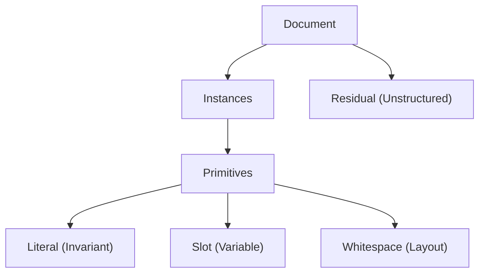

# Wring

Single-document template induction from internal repetition.

Give Wring **one** document that has repeated structure, such as a log or an HTML
page, and it returns the recurring **templates** (fixed boilerplate with variable
**slots**) plus the values that fill each slot. It is lossless: the templates and
their slot values reconstruct the original document exactly.

## What you actually get

**A log file → one template, one slot per field.**

```bash
node general/induce.js general/fixtures/access.log --group align
```

```
in    192.168.1.10 - - [05/Jun/2026:10:00:01 +0000] "GET /api/users/1 HTTP/1.1" 200 1534
      192.168.1.11 - - [05/Jun/2026:10:00:02 +0000] "GET /api/users/2 HTTP/1.1" 200 1622
      … 8 lines …

out   192.168.1.${0} - - [05/Jun/2026:10:00:${1} +0000] "${2} /api/${3}/${4} HTTP/1.1" ${5} ${6}
        ${0} ip   ${1} seconds   ${2} method   ${3} resource   ${4} id   ${5} status   ${6} bytes
```

The boilerplate collapses into one template and the data falls out as labeled
columns. (7 of the 8 lines fit this template. The 8th has a different shape, so
Wring reports it separately instead of forcing a bad fit.)

**Raw HTML → the repeated components.**

```bash
node dom-signatures/induce-from-html.js dom-signatures/fixtures/sample.html
```

```
out   div.flex.…rounded-full.h-9.w-9.bg-text-${0}00.text-bg-100      ← avatar      slot = 2,3,4,5
      h3#_r_${0}.text-[12px].break-words.text-text-100.line-clamp-4   ← list heading slot = the id
      button.inline-flex.…font-base-bold.rounded-${0}                ← button      slot = md / lg
```

Same idea on DOM structure: each repeated UI component surfaces as a template, its
per-instance differences as slots.

**That is the deliverable.** Boilerplate is separated from data, and the split
reverses exactly. Everything below is how it is built and what is still open.

## Status & what exists today

Two paths run end-to-end (text→templates and HTML→templates), and **every stage of
the five-stage pipeline now has a working, tested implementation.** See
[`ARCHITECTURE.md`](ARCHITECTURE.md) for the canonical pipeline.

| | What | Where |
|---|---|---|
| ✅ **Runnable** | **End-to-end general-text induction**: Tokenize, grammar, then group (bookend *or* structural align) | [`general/`](general/README.md) |
| ✅ **Runnable** | **End-to-end DOM induction**: raw HTML to signatures to slotted templates | [`dom-signatures/induce-from-html.js`](dom-signatures/induce-from-html.js) |
| ✅ **Runnable** | Interactive browser demo: group signatures, or paste raw HTML (Stage 1 + 3) | [`dom-signatures/demo.html`](dom-signatures/demo.html) |
| ✅ **Runnable** | `tokenize` and `extractSignatures`: segmenters (Stage 1) | [`general/`](general/README.md), [`dom-signatures/`](dom-signatures/README.md) |
| ✅ **Runnable** | `induceGrammar`: grammar induction via Re-Pair (Stage 2) | [`general/grammar.js`](general/grammar.js) |
| ✅ **Runnable** | `groupByTemplate` (literal bookends) and `groupByAlignment` (positional): Stage 3 | [`dom-signatures/`](dom-signatures/README.md), [`general/`](general/README.md) |
| ✅ **Runnable** | `selectTemplates`: MDL plus exact weighted interval scheduling (Stage 4) | [`selection/`](selection/README.md) |
| 📝 **Spec only** | Online Sequitur (Re-Pair stands in for Stage 2 today) | `ARCHITECTURE.md` |
| 📚 **Research** | Suffix-tree prototype, LLM research reports, conceptual foundations | `phase-1-discovery/`, [`research/`](research/README.md), `exploration/` |

Run the whole test suite (six harnesses, all green):

```bash
for t in dom-signatures/test-signatures.js dom-signatures/test-extract.js \
         general/test-grammar.js general/test-induce.js general/test-align.js \
         selection/test-mdl-select.js; do node "$t" >/dev/null && echo "ok $t"; done
```

**What's still open** (honest frontiers, not loose ends): reconciling records whose
field *count* differs; discovering record boundaries with no delimiter; and putting
the [`selection/`](selection/README.md) MDL layer to work once a generator emits
overlapping candidates. Full findings in [`general/README.md`](general/README.md).

## Problem

Given one document, infer a compact set of recurring patterns (templates) and an instance map of their occurrences. 

The goal is to optimize for a balance of compression and human interpretability.


```mermaid
flowchart TD
    Document --> Instances
    Document --> Residual["Residual (Unstructured)"]

    Instances --> Primitives
    
    Primitives --> Literal["Literal (Invariant)"]
    Primitives --> Slot["Slot (Variable)"]
    Primitives --> Whitespace["Whitespace (Layout)"]
```

## Use Cases

Prioritize interpretability over maximal compression:
 * Structured documents (budget bills, legislation): infer markup structure for annotation or XML conversion
 * Web development: convert repetitive HTML into data-driven JS generation
 * Logs: separate boilerplate from variable content to surface the actual information

## Core Objectives

 * **Character Allocation**: Every character, including whitespace, is allocated to one of three primitive types: Literals, Slots, or Whitespace. Un-patterned text is designated as Residual.
 * **Reconstruction Fidelity**: The default model aims for exact reproduction. By treating Whitespace as a distinct primitive, the system can optionally expunge "formatting noise" for readability, acknowledging the trade-off.
 * **Structural Separation**: The system decomposes the document into recurring structural patterns (templates) and their specific occurrences (instances), separating boilerplate from variable content.
 * **Browser-First Performance**: Discovery and indexing logic is optimized for browser memory and execution limits (~100KB-10MB range), utilizing WASM for high-density indexing where necessary.

## Key Assumptions

* **Templates are Grounded in Repeats**: Templates link repeated substrings. We can start from repeated substrings and get to any template. 
* **The "DRY" Objective**: The goal is to "dry up" a document to make the underlying data more intelligible by removing redundant text.
* **Structural vs. Floating Repeats**: Some repeats are "foundational" and tied to document architecture; others are "floating" or transversal. What constitutes structure must be assessed from a perspective. Low variance in relative distance suggests structural; high variance suggests incidental.
* **Idealized Forms**: A template should bind to a meaningful structure. This may involve gravitating toward instances that support a coherent model, and away from instances that pollute it.
* **Flat or Hierarchical**: Instances may cover disjoint regions (flat model, simple interval scheduling) or form a parse DAG where templates contain other templates (hierarchical model, captures nesting but requires defined decoding order). Either may be of interest depending on the document.
* **Navigable Discovery**: Discovery may benefit from a human-in-the-loop process. The algorithm proposes potential structures; the user navigates and selects the abstractions that are most meaningful.

---

## Pipeline

Five stages, and every one has a real implementation today. See
[`ARCHITECTURE.md`](ARCHITECTURE.md) for full detail.

| Stage | Goal | Implemented by |
|-------|------|----------------|
| Tokenize | Segment the document into a symbol stream | `general/tokenize.js`, `dom-signatures/extract-signatures.js` |
| Grammar | Find exact repeats; build a grammar | `general/grammar.js` (Re-Pair; ARCHITECTURE names Sequitur) |
| Bookend Merge | Align near-identical sequences; discover slots | `dom-signatures/group-by-template.js` (literal bookends) · `general/align-group.js` (structural) |
| Selection | Rank by MDL; resolve overlaps | greedy slice in `group-by-template.js` · full version in `selection/mdl-select.js` |
| Extraction | Map back to the source; verify reconstruction | reconstruction is verified end-to-end on both paths (lossless) |

### Two working pipelines

- **General text** ([`general/`](general/README.md)): `tokenize` → `induceGrammar`
  (Re-Pair) → group by **bookend** or **structural alignment** → reconstruction check.
  Driver: `general/induce.js`. Best on records with many independent fields (logs).
- **DOM** ([`dom-signatures/`](dom-signatures/README.md)): `extractSignatures` →
  `groupByTemplate` (+ greedy MDL selection) → reconstruction check. Driver:
  `induce-from-html.js`, plus an [interactive demo](dom-signatures/demo.html). On 81
  hand-collected signatures it groups 90-91% with 100% reconstruction fidelity.

### Earlier phase specs

The `phase-*/` directories contain detailed specs (interfaces, algorithms, failure modes) written before the Sequitur + Bookend Merge pivot. Each has a status header indicating what still applies. They remain useful reference material.

| Directory | Status |
|---|---|
| [`phase-1-discovery/`](phase-1-discovery/README.md) | Partially superseded (interfaces and failure modes valid; algorithm replaced by Sequitur) |
| [`phase-2-topology/`](phase-2-topology/README.md) | Superseded (replaced by Bookend Merge) |
| [`phase-3-refinement/`](phase-3-refinement/README.md) | Partially superseded (alignment and consolidation concepts valid; input interface changed) |
| [`phase-4-selection/`](phase-4-selection/README.md) | Current (algorithms are path-independent) |

---

## Exploration

Conceptual foundations and terminology live in `exploration/`:

- **Intuition.md**: First-principles observations about template structure
- **Terms.md**: Vocabulary for matching (seat, bind, register) and emergence (crystallize, induce, distill)
- **Order.md**: Quantifying ordered relationships; distinguishing structural anchors from variable decoys